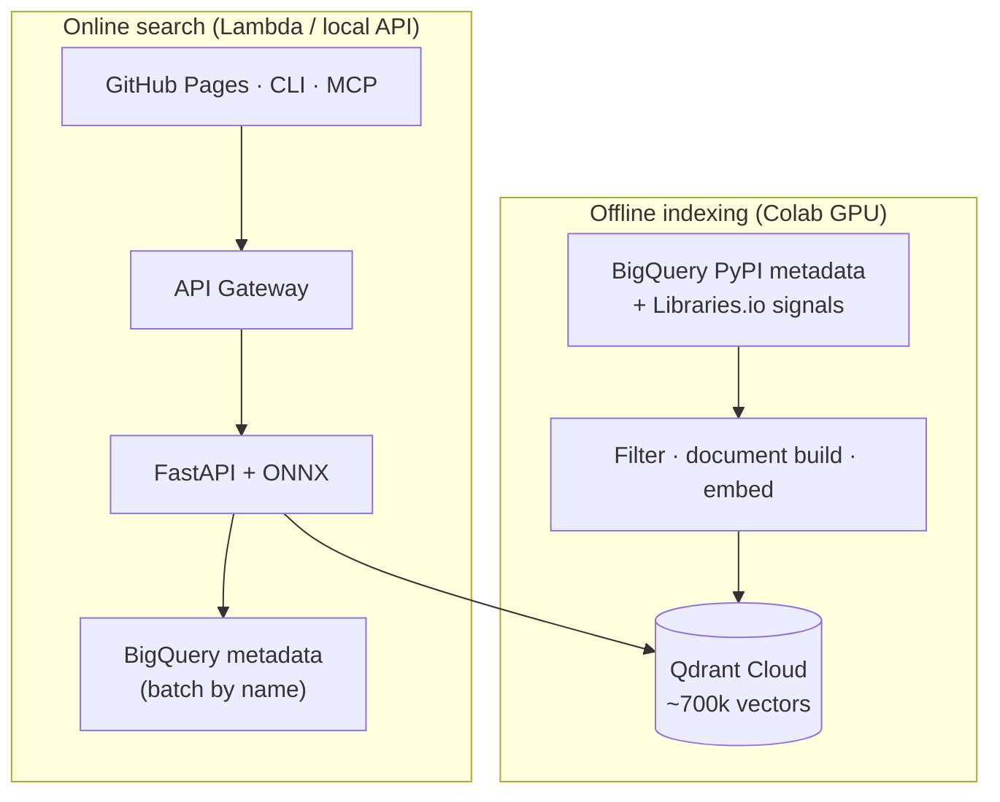
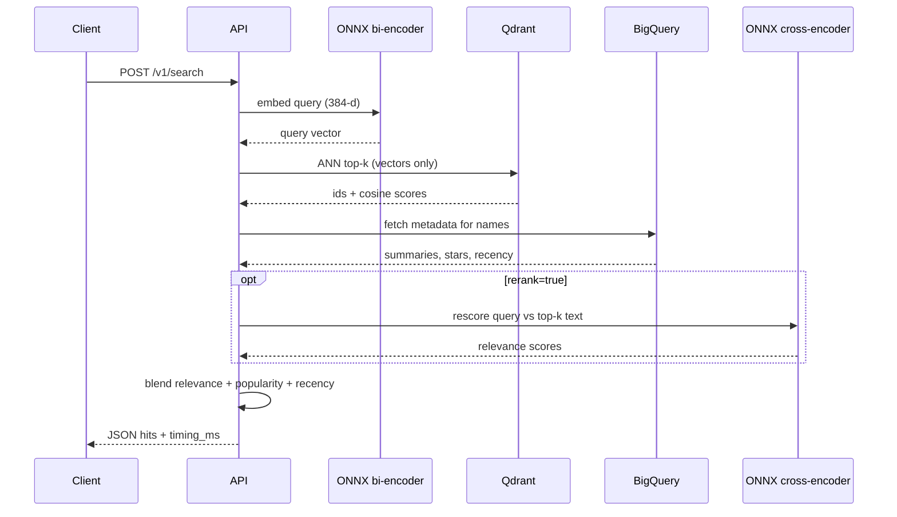

# SARR — Semantic Artifacts Retrieval and Ranking

SARR is a search system for software packages that ranks results by **meaning**,
not just keyword overlap. The index covers **~700k PyPI packages** (filtered from
current PyPI BigQuery metadata) and answers natural-language queries such as
*“async HTTP client with retries”* or *“machine learning”* — including packages
whose names do not contain those words.

Offline indexing runs on GPU (Google Colab) with **PyTorch**. Online search
embeds the query, retrieves neighbors, optionally reranks, and blends
popularity and recency. An optional **LLM** path (Vertex Gemini) writes a
grounded top-3 from the retrieved packages only. Vectors live in **Qdrant
Cloud**. The API is **FastAPI** on **AWS Lambda**, where both the bi-encoder
and the cross-encoder run as **ONNX** (no PyTorch import on the request path).
The demo UI is a static Vite app on **GitHub Pages**. An optional **MCP**
stdio server lets coding agents call the same API as tools (`search_packages`,
`recommend_packages`, `health`) without loading ONNX or Gemini locally.

- **Live demo:** [kanchana123.github.io/sarr-recommendation-api](https://kanchana123.github.io/sarr-recommendation-api/)
- **API:** `https://isz2aki1n2.execute-api.us-east-1.amazonaws.com` (`/v1/search`, `/v1/rag`, `/healthz`)
- **Write-up:** [DEV Community](https://dev.to/kanchan_nannavare/sarr-semantic-search-for-pypi-packages-built-on-a-serverless-budget-o4n)

---

## Why it exists

[PyPI.org](https://pypi.org) search is effective when you already know a package
name. It is less helpful when you only know the *problem*. SARR treats each
package as a short semantic document (name, description, keywords, stack hints)
and retrieves neighbors in embedding space, then reorders with maintenance and
adoption signals so popular, fresher projects tend to surface when relevance is
close.

---

## Architecture

Offline indexing (GPU, infrequent) is separate from online search (CPU, per
request). Both paths share the same bi-encoder checkpoint
(`BAAI/bge-small-en-v1.5`) and search-document format. ETL uses PyTorch;
Lambda serves the same weights as ONNX.

**Storage split:** Qdrant holds **vectors + package name only** (~700k points,
fits free-tier disk). **Rich metadata** (summary, stars, forks, URLs) lives in
**BigQuery** and is fetched after vector retrieval, then used for rerank and
blending.

### System context



### Search request path



Legacy PNG exports (optional): `docs/diagrams/architecture.png`,
`docs/diagrams/search-sequence.png` — regenerate from the diagrams above when
updating marketing assets.

| Path | Role |
|---|---|
| **ETL** | Filtered PyPI BigQuery extract → document build → PyTorch embed → Qdrant upsert (vector + name) |
| **Online search** | ONNX query embed → Qdrant ANN → BigQuery hydrate → optional ONNX rerank → α·relevance + β·popularity + δ·recency |
| **Online RAG** | Same retrieval + hydrate (50 → top 10) → SSE `ranked_list` → Vertex Gemini top-3 with citation checks |
| **MCP (agents)** | Local stdio server → HTTP to the API; RAG SSE collapsed to one JSON tool result |
| **Shared** | Same embedding model and search-document format for index and query (no train/serve skew) |

Designed so indexing (heavy, infrequent, GPU) stays separate from serving
(lightweight per request). The Lambda container path and SAM template are in
`docker/` and `infra/` for a serverless deploy without changing the search core.

---

## Retrieval & ranking

- **Bi-encoder:** `BAAI/bge-small-en-v1.5` (384‑d). Colab ETL embeds the corpus with PyTorch; Lambda embeds queries with a baked ONNX graph.  
- **ANN:** cosine similarity over the full collection in Qdrant  
- **Rerank (optional):** `cross-encoder/ms-marco-MiniLM-L-6-v2` on a short top‑k list. Hosted Lambda runs this as ONNX as well (`rerank: true` in `POST /v1/search`). The demo **Rerank** checkbox controls this only.  
- **LLM / RAG (optional):** `POST /v1/rag` when the demo **LLM** checkbox is on. The UI lists **10** ranked packages first (`ranked_list`), then Gemini writes a citation-checked **top-3** from that set. Generation does not run unless **LLM** is checked.  
- **Demo results list:** `POST /v1/search` defaults to `limit=10`; the Search page shows all **10** blended hits. With **LLM**, the same **10** appear above the Gemini block.  
- **Blend:** semantic score mixed with stars / dependents / SourceRank and release recency  

Numeric popularity is loaded from **BigQuery after retrieval**, not stuffed into
the embedding text, so similarity stays about *what the package does*.

---

## RAG (grounded recommendations)

`POST /v1/rag` is opt-in. The demo **LLM** checkbox is the only UI control that
calls it. **Rerank** only toggles the cross-encoder (`rerank: true|false` on
search or RAG).

Pipeline:

1. Retrieve 50 neighbors (same embedder and Qdrant collection as `/v1/search`).
2. Hydrate metadata from BigQuery for those names (same as search).
3. Optionally rerank those 50 with MiniLM; keep the **top 10** after blend for
   the ranked list and Gemini context (`RAG_CONTEXT_K=10`).
4. Stream `ranked_list` first (10 hits) so the UI is complete without Gemini.
5. Prompt Gemini with **name + description only** (no stars or URLs).
6. Parse JSON (`package`, `reason`, `cited_snippet`). Drop any package name
   that is not in the retrieved ten. Stream `llm_done` or `llm_error`.

Local defaults: `VERTEX_GEMINI_MODEL=gemini-2.5-flash-lite` with fallback
`gemini-2.5-flash`. Set `GCP_PROJECT_ID`. Locally, use `gcloud auth
application-default login`. On Lambda, put a Vertex service account JSON in
Secrets Manager (`sarr-search/gcp-vertex`); laptop ADC is not available there.
Vertex billing must be enabled. API Gateway HTTP APIs do not stream SSE well;
run RAG locally (`make run-api`) or on Cloud Run.

```bash
curl -N http://localhost:8080/v1/rag \
  -H 'Content-Type: application/json' \
  -d '{"query":"async HTTP client","rerank":true}'
```

API Gateway may buffer SSE on `/v1/rag`, so the UI can receive ranked and LLM
events together.

---

## Performance

Latency below is **server `took_ms`** (embed + Qdrant + BigQuery hydrate +
optional rerank + blend). **`timing_ms`** also includes `bq_ms` after the
700k / vectors-only migration. **Client RTT** includes network to `us-east-1`.
Cold start is quoted separately — do not fold it into p50/p95/p99.

| Condition | Server `took_ms` | Notes |
|---|---|---|
| Indexed corpus | — | **~700,000** packages (filtered PyPI metadata; vectors in Qdrant) |
| Corpus freshness | — | PyPI `distribution_metadata` + Libraries.io popularity join |
| Cold, `rerank=false` | *TBD* | First request after idle; loads ONNX bi-encoder |
| Cold, `rerank=true` | *TBD* | Also loads ONNX MiniLM cross-encoder |
| Warm, `rerank=false` | *TBD* (p50 / p95 / p99) | Remeasure after 700k + BQ hydrate path |
| Warm, `rerank=true` | *TBD* (p50 / p95 / p99) | Includes cross-encoder on hydrated summaries |
| Warm stages | embed *TBD* · Qdrant *TBD* · BQ *TBD* | From `timing_ms` on `/v1/search` |
| Hosted RAG (warm, rerank + LLM) | ranked *TBD* · Gemini *TBD* | `took_ms` + `llm_ms`; SSE may not stream on API Gateway |

Re-run after deploy:

```bash
python3 scripts/measure_latency.py --url "$SARR_API_URL" --n 50
python3 scripts/measure_latency.py --url "$SARR_API_URL" --n 50 --rerank --skip-warmup
```

Each response includes `took_ms` and `timing_ms` (`embed_ms`, `qdrant_ms`,
`bq_ms`, `rerank_ms`, `blend_ms`).

### How to measure latency

Warmup **once**, then run sequential searches. Do not mix the first cold load into p50/p95.

```bash
# Hosted API — no rerank
python3 scripts/measure_latency.py \
  --url https://isz2aki1n2.execute-api.us-east-1.amazonaws.com \
  --n 50

# Hosted API — with rerank (warm up once; cold start can 503 at 30 s)
curl -s "$SARR_API_URL/v1/search" -H 'Content-Type: application/json' \
  -d '{"query":"warmup","limit":5,"rerank":true}' >/dev/null
python3 scripts/measure_latency.py --url "$SARR_API_URL" --n 50 --rerank --skip-warmup

# Local API (start it first)
export SARR_API_URL=http://localhost:8080
make latency
```

The script prints per-request client RTT and the server’s `took_ms` / `embed_ms` / `qdrant_ms`, then p50 / p95 / p99. One-off:

```bash
curl -sS -w "\nHTTP:%{http_code} TIME:%{time_total}\n" \
  "$SARR_API_URL/v1/search" \
  -H 'Content-Type: application/json' \
  -d '{"query":"async HTTP client","limit":10,"rerank":false}' | python3 -m json.tool
```

Look at `took_ms` and `timing_ms` in the JSON for server-side time; curl’s `TIME` is the full round trip.

ETL is **checkpointed by watermark** after each successful batch: a Colab
disconnect resumes without duplicating points (Qdrant upserts by stable package
id).

---

## Tech stack

| Layer | Choice |
|---|---|
| Data | PyPI BigQuery `distribution_metadata` + Libraries.io join; metadata hydrate at search |
| ML | sentence-transformers / PyTorch (ETL); ONNX Runtime (Lambda embed + rerank); Vertex Gemini (optional RAG) |
| Store | Qdrant Cloud (~700k vectors + name); BigQuery for online metadata |
| API | FastAPI, Pydantic v2, Mangum (Lambda); SSE on `POST /v1/rag` |
| Packaging | `src/` layout, `pyproject.toml`, optional extras (`api` / `etl` / `dev`) |
| UI | Vite static multi-page demo |
| Agents | MCP stdio server (`sarr[mcp]`) — tools wrap `/v1/search`, `/v1/rag`, `/healthz` |
| Quality | pytest unit suite, Ruff, GitHub Actions CI |
| Deploy artifacts | Docker (local API + Lambda image), SAM template |

---

## Repository layout

```text
sarr-recommendation-api/
├── src/sarr/
│   ├── common/     # schemas, search-document builder, settings
│   ├── api/        # FastAPI, embedder, reranker, RAG + Gemini, ranking, Qdrant client
│   ├── mcp/        # MCP stdio tools → HTTP API (search + RAG)
│   └── etl/        # BigQuery extract → transform → embed → load
├── notebooks/      # Colab GPU ETL
├── frontend/       # Search · How it works · Contact
├── docker/         # API + Lambda images
├── infra/          # SAM template, deploy.env.example, deploy docs
├── scripts/        # setup_gcp_vertex_auth.sh, deploy_lambda.sh, measure_latency.py
└── tests/          # unit (CI) + opt-in integration
```

---

## Quick start (local API + Qdrant Cloud)

```bash
cp .env.example .env   # set QDRANT_URL, QDRANT_API_KEY, QDRANT_COLLECTION
python3 -m venv .venv && source .venv/bin/activate
make install
make run-api           # http://localhost:8080
```

### CLI

Install once, then search without typing a URL (defaults to
`http://localhost:8080`, or `$SARR_API_URL` if set).

```bash
# terminal 1 — start the API (once)
cp .env.example .env   # Qdrant Cloud credentials
pip install -e ".[api]"
make run-api

# terminal 2 — use the CLI
pip install -e .       # lightweight client is enough when using the API
sarr health
sarr search "async HTTP client"
sarr search "machine learning" -n 5 --rerank
sarr search "http library" --json
```

Optional: point at another host without flags on every command:

```bash
export SARR_API_URL=https://your-deployed-api.example.com
sarr search "dataframe library"
```

In-process mode (no server; loads models locally):

```bash
pip install -e ".[api]"
sarr search "http client" --local
```

### MCP (agents / Cursor)

Thin **stdio wrapper** around the HTTP API. The MCP process uses `httpx` only —
no ONNX, Qdrant, or Gemini loaded in the agent's MCP child process. **Does not
run on Lambda**; run it locally (or on any machine with Cursor) and point
`SARR_API_URL` at a running API.

```bash
python3 -m venv .venv && source .venv/bin/activate   # once
make install-mcp
make run-api   # terminal 1

# terminal 2 — blocks on stdio; wire Cursor to this process
export SARR_API_URL=http://localhost:8080
make run-mcp
```

| Tool | API | When to use |
|---|---|---|
| `search_packages` | `POST /v1/search` | Fast semantic lookup (`query`, `limit`, `rerank`) |
| `recommend_packages` | `POST /v1/rag` | Grounded top-3 with citations; waits for SSE, returns one JSON blob |
| `health` | `GET /healthz` | Check the API before searching |

`recommend_packages` output shape (agents never see SSE tokens):

```json
{
  "query": "async HTTP client",
  "ranked": [{ "name": "httpx", "summary": "…", "score": 0.9, "stars": 12000 }],
  "recommendations": [{ "package": "httpx", "reason": "…", "cited_snippet": "…" }],
  "dropped": [],
  "fast_path_ms": 420,
  "llm_ms": 1050,
  "error": null
}
```

If Gemini fails, `error` is set and `ranked` is still populated — same contract
as the demo UI. Citation guardrails stay on the API; MCP does not invent packages.

**Cursor:** copy [`.cursor/mcp.json.example`](.cursor/mcp.json.example) → `.cursor/mcp.json`, reload MCP. Use `http://localhost:8080` for development, or the hosted `ApiUrl` for search and RAG (API Gateway may deliver RAG SSE in one block).

```bash
mcp dev src/sarr/mcp/server.py   # optional Inspector (pip install "mcp[cli]")
```

```bash
curl -s http://localhost:8080/v1/search \
  -H 'Content-Type: application/json' \
  -d '{"query":"http client library","limit":5,"rerank":false}'
```

```bash
cd frontend && cp .env.example .env && npm install && npm run dev
```

### Docker (recommended for reviewers)

Requires [Docker](https://docs.docker.com/get-docker/) + Compose. The API image
bundles FastAPI and the embedding stack; point it at **Qdrant Cloud** (the
indexed corpus) via `.env`.

```bash
git clone https://github.com/kanchana123/sarr-recommendation-api.git
cd sarr-recommendation-api
cp .env.example .env
# Edit .env — set at least:
#   QDRANT_URL=https://….aws.cloud.qdrant.io
#   QDRANT_API_KEY=…
#   QDRANT_COLLECTION=sarr

docker compose up --build -d
# or: make docker-up

curl -s http://localhost:8080/healthz
curl -s http://localhost:8080/v1/search \
  -H 'Content-Type: application/json' \
  -d '{"query":"machine learning","limit":5,"rerank":false}'

docker compose logs -f api    # first search downloads model weights (~once; cached in a volume)
docker compose down
```

Build the image alone:

```bash
docker build -f docker/Dockerfile.api -t sarr-api:latest .
docker run --rm -p 8080:8080 --env-file .env sarr-api:latest
```

Optional empty local Qdrant (no corpus until you run ETL):

```bash
QDRANT_URL=http://qdrant:6333 docker compose --profile local-qdrant up --build
```

### Deploy to AWS Lambda

Full pipeline: **[infra/README.md](infra/README.md)**.

```bash
cp infra/deploy.env.example infra/deploy.env   # Qdrant URL + key
make gcp-setup-vertex                          # Vertex SA → Secrets Manager (before deploy)
make deploy-lambda-guided                        # first time
make deploy-lambda                               # later redeploys
# or: make deploy-lambda-full                    # GCP auth + deploy in one step
```

Scripts live in `scripts/setup_gcp_vertex_auth.sh` and `scripts/deploy_lambda.sh`.
SAM template: `infra/template.yaml`. Example config: `samconfig.toml.example`.

Stack output **ApiUrl** is the public endpoint (`/v1/search`, `/v1/rag`, `/healthz`).
Set `GcpProjectId=sarr-505305` (default) plus the GCP secret from `make gcp-setup-vertex`
so the hosted UI **LLM** checkbox can call Vertex Gemini.

GitHub Pages: set repository variable `VITE_API_BASE_URL` to that `ApiUrl`, enable Pages
with **Source: GitHub Actions**, then run **Deploy frontend** (`.github/workflows/pages.yml`).

### ETL (Colab)

Open `notebooks/etl_colab.ipynb`, use a GPU runtime, set billing `GCP_PROJECT_ID`
and Qdrant credentials, run the diagnostic count, then the full pipeline.
`LAST_UPDATE_DATE=1970-01-01` for the initial load; afterward the watermark file
drives incremental runs.

### Tests

```bash
make install-dev
make test
```

---

## API

| Method | Path | Notes |
|---|---|---|
| `GET` | `/healthz` | Liveness |
| `POST` | `/v1/search` | `{ "query", "limit", "rerank" }` → ranked hits + `took_ms` |
| `POST` | `/v1/rag` | `{ "query", "rerank" }` → SSE `ranked_list`, then `llm_delta` / `llm_done` (Vertex Gemini, citation-checked top-3) |

OpenAPI docs: `http://localhost:8080/docs`

The demo UI has two independent checkboxes. **Rerank** sends `rerank` on
`/v1/search` (or on `/v1/rag` when LLM is also on). **LLM** is the only control
that calls `/v1/rag` and Gemini. Every search shows **10** ranked cards (classic
search or RAG `ranked_list`); Gemini adds a separate **top-3** section when
**LLM** is checked.

**MCP** exposes the same endpoints as agent tools: `search_packages` → `/v1/search`, `recommend_packages` → `/v1/rag` (SSE consumed server-side), `health` → `/healthz`. See [MCP (agents / Cursor)](#mcp-agents--cursor) above.

`POST /v1/rag` streams Server-Sent Events. The ranked list is emitted first; generation uses Vertex Gemini (`GCP_PROJECT_ID` plus ADC locally, or a Secrets Manager service account on Lambda). API Gateway HTTP APIs do not stream well — the MCP tool still works by waiting for the full SSE response. The eval harness (precision@k, citation accuracy, faithfulness, cost) is a follow-on deliverable.

---

## Roadmap

- Publish updated latency percentiles for the 700k + BigQuery-hydrate search path
- Hybrid sparse + dense retrieval for exact name matches
- Larger eval set (nDCG) for ranking weight tuning

---

## License

See [LICENSE](LICENSE).
