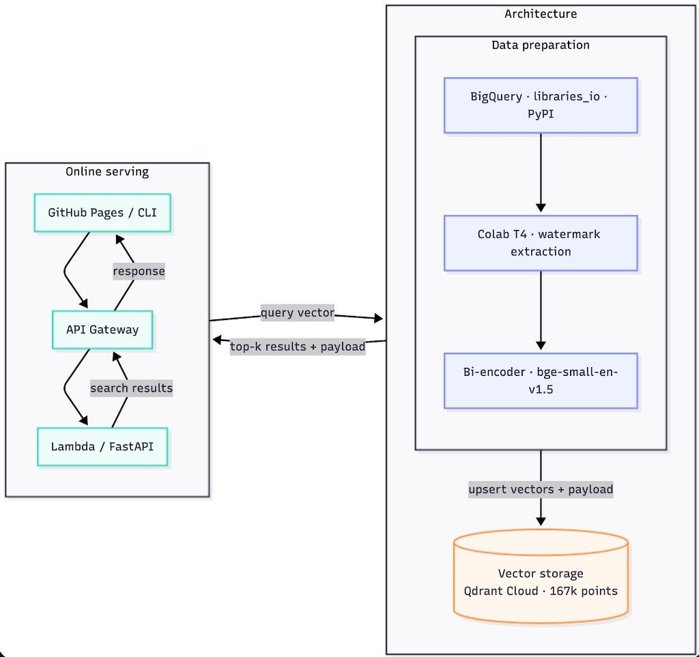
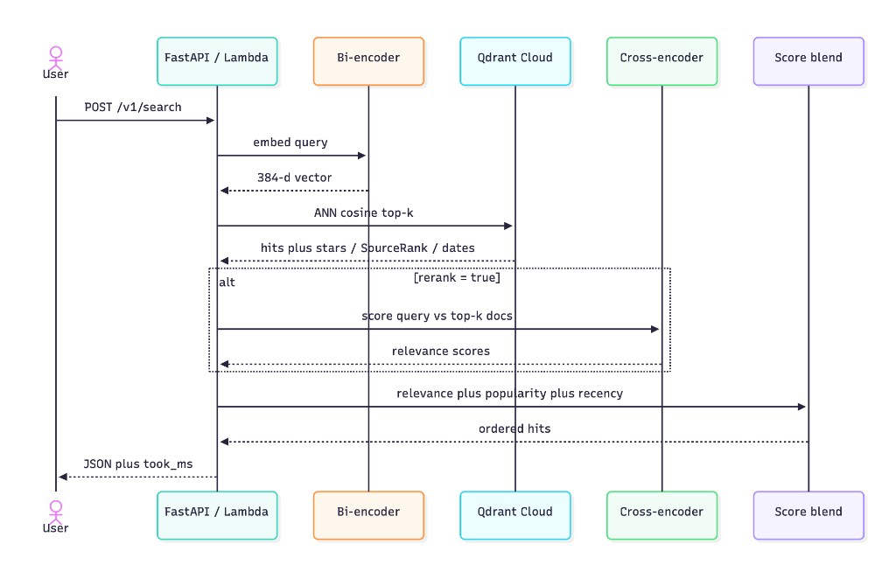

# SARR — Semantic Artifacts Retrieval and Ranking

SARR is a search system for software packages that ranks results by **meaning**,
not just keyword overlap. The MVP indexes **~168k PyPI packages** and answers
natural-language queries such as *“async HTTP client with retries”* or
*“machine learning”* — including packages whose names do not contain those words.

Offline indexing runs on GPU (Google Colab) with **PyTorch**. Online search
embeds the query, retrieves neighbors, optionally reranks, and blends
popularity and recency. Vectors live in **Qdrant Cloud**. The API is
**FastAPI** on **AWS Lambda**, where both the bi-encoder and the
cross-encoder run as **ONNX** (no PyTorch import on the request path). The
demo UI is a static Vite app on **GitHub Pages**.

**Live demo:** [kanchana123.github.io/sarr-recommendation-api](https://kanchana123.github.io/sarr-recommendation-api/)
**API:** `https://isz2aki1n2.execute-api.us-east-1.amazonaws.com` (`/v1/search`, `/healthz`)
**Write-up:** [DEV Community](https://dev.to/kanchan_nannavare/sarr-semantic-search-for-pypi-packages-built-on-a-serverless-budget-o4n)

---

## Why it exists

[PyPI.org](https://pypi.org) search is effective when you already know a package
name. It is less helpful when you only know the *problem*. SARR treats each
package as a short semantic document (name, description, keywords, stack hints)
and retrieves neighbors in embedding space, then reorders with maintenance and
adoption signals so popular, fresher projects tend to surface when relevance is
close.

---

## Architecture

Offline indexing (GPU, infrequent) is separate from online search (CPU, per request). Both paths share the same bi-encoder checkpoint (`BAAI/bge-small-en-v1.5`) and search-document format. ETL uses PyTorch; Lambda serves the same weights as ONNX.



Request path inside the API (`took_ms` is server-side time):



| Path | Role |
|---|---|
| **ETL** | Watermarked BigQuery extract → document build → PyTorch bi-encoder batch embed → idempotent Qdrant upsert |
| **Online** | ONNX query embed → top‑k vector search → optional ONNX cross-encoder → α·relevance + β·popularity + δ·recency |
| **Shared** | Same embedding model and search-document format for index and query (no train/serve skew) |

Designed so indexing (heavy, infrequent, GPU) stays separate from serving
(lightweight per request). The Lambda container path and SAM template are in
`docker/` and `infra/` for a serverless deploy without changing the search core.

---

## Retrieval & ranking

- **Bi-encoder:** `BAAI/bge-small-en-v1.5` (384‑d). Colab ETL embeds the corpus with PyTorch; Lambda embeds queries with a baked ONNX graph.  
- **ANN:** cosine similarity over the full collection in Qdrant  
- **Rerank (optional):** `cross-encoder/ms-marco-MiniLM-L-6-v2` on a short top‑k list. Hosted Lambda runs this as ONNX as well (`rerank: true` in `POST /v1/search`).  
- **Blend:** semantic score mixed with stars / dependents / SourceRank and release recency  

Numeric popularity is kept in the **payload**, not stuffed into the embedding
text, so similarity stays about *what the package does*.

---

## Performance (MVP measurements)

Latency below is **server `took_ms`** (embed + Qdrant + optional rerank + blend). That is the number to quote for serving performance. **Client RTT** includes the network to `us-east-1` and is what a browser feels; do not mix it into p99 unless you say where the client ran. Cold start is quoted separately — do not fold it into p50/p95/p99.

| Condition | Server `took_ms` | Notes |
|---|---|---|
| Full index load | — | **167,619** packages embedded + upserted (Colab T4, PyTorch) |
| Corpus freshness | — | Libraries.io slice; newest `latest_release` in this dump is **Dec 2018** |
| Cold, `rerank=false` | **~5 s** | First request after idle; loads ONNX bi-encoder |
| Cold, `rerank=true` | **~16 s** | Also loads ONNX MiniLM cross-encoder |
| Warm, `rerank=false` | **p50 18 ms · p95 26 ms · p99 30 ms** | 50 sequential mixed queries |
| Warm, `rerank=true` | **p50 176 ms · p95 266 ms · p99 270 ms** | ~160 ms extra for the cross-encoder; a typical UI call is ~200–230 ms |
| Warm stages | embed **~7 ms**, Qdrant **~9–11 ms** (p50) | Same with or without rerank |

Warm percentiles: `scripts/measure_latency.py`, 15 Aug 2026, 1 warmup + 50 requests, all succeeded. Client RTT from this laptop was p50 **~122 ms** (no rerank) and **~276 ms** (rerank). API Gateway HTTP APIs still cap the client wait at **30 s**, which is why Lambda uses ONNX instead of importing PyTorch.

Each response also includes `took_ms` and `timing_ms` (`embed_ms`, `qdrant_ms`, `rerank_ms`).

### How to measure latency

Warmup **once**, then run sequential searches. Do not mix the first cold load into p50/p95.

```bash
# Hosted API
python3 scripts/measure_latency.py \
  --url https://isz2aki1n2.execute-api.us-east-1.amazonaws.com \
  --n 50

# Local API (start it first)
export SARR_API_URL=http://localhost:8080
make latency
```

The script prints per-request client RTT and the server’s `took_ms` / `embed_ms` / `qdrant_ms`, then p50 / p95 / p99. One-off:

```bash
curl -sS -w "\nHTTP:%{http_code} TIME:%{time_total}\n" \
  "$SARR_API_URL/v1/search" \
  -H 'Content-Type: application/json' \
  -d '{"query":"async HTTP client","limit":10,"rerank":false}' | python3 -m json.tool
```

Look at `took_ms` and `timing_ms` in the JSON for server-side time; curl’s `TIME` is the full round trip.

ETL is **checkpointed by watermark** after each successful batch: a Colab
disconnect resumes without duplicating points (Qdrant upserts by stable package
id).

---

## Tech stack

| Layer | Choice |
|---|---|
| Data | BigQuery public Libraries.io (`projects` ⨝ `repositories`), PyPI filter |
| ML | sentence-transformers / PyTorch (ETL); ONNX Runtime (Lambda embed + rerank) |
| Store | Qdrant Cloud |
| API | FastAPI, Pydantic v2, Mangum (Lambda) |
| Packaging | `src/` layout, `pyproject.toml`, optional extras (`api` / `etl` / `dev`) |
| UI | Vite static multi-page demo |
| Quality | pytest unit suite, Ruff, GitHub Actions CI |
| Deploy artifacts | Docker (local API + Lambda image), SAM template |

---

## Repository layout

```text
sarr-recommendation-api/
├── src/sarr/
│   ├── common/     # schemas, search-document builder, settings
│   ├── api/        # FastAPI, embedder, reranker, ranking, Qdrant client
│   └── etl/        # BigQuery extract → transform → embed → load
├── notebooks/      # Colab GPU ETL
├── frontend/       # Search · How it works · Contact
├── docker/         # API + Lambda images
├── infra/          # SAM (API Gateway + Lambda)
└── tests/          # unit (CI) + opt-in integration
```

---

## Quick start (local API + Qdrant Cloud)

```bash
cp .env.example .env   # set QDRANT_URL, QDRANT_API_KEY, QDRANT_COLLECTION
python3 -m venv .venv && source .venv/bin/activate
make install
make run-api           # http://localhost:8080
```

### CLI

Install once, then search without typing a URL (defaults to
`http://localhost:8080`, or `$SARR_API_URL` if set).

```bash
# terminal 1 — start the API (once)
cp .env.example .env   # Qdrant Cloud credentials
pip install -e ".[api]"
make run-api

# terminal 2 — use the CLI
pip install -e .       # lightweight client is enough when using the API
sarr health
sarr search "async HTTP client"
sarr search "machine learning" -n 5 --rerank
sarr search "http library" --json
```

Optional: point at another host without flags on every command:

```bash
export SARR_API_URL=https://your-deployed-api.example.com
sarr search "dataframe library"
```

In-process mode (no server; loads models locally):

```bash
pip install -e ".[api]"
sarr search "http client" --local
```

```bash
curl -s http://localhost:8080/v1/search \
  -H 'Content-Type: application/json' \
  -d '{"query":"http client library","limit":5,"rerank":false}'
```

```bash
cd frontend && cp .env.example .env && npm install && npm run dev
```

### Docker (recommended for reviewers)

Requires [Docker](https://docs.docker.com/get-docker/) + Compose. The API image
bundles FastAPI and the embedding stack; point it at **Qdrant Cloud** (the
indexed corpus) via `.env`.

```bash
git clone https://github.com/kanchana123/sarr-recommendation-api.git
cd sarr-recommendation-api
cp .env.example .env
# Edit .env — set at least:
#   QDRANT_URL=https://….aws.cloud.qdrant.io
#   QDRANT_API_KEY=…
#   QDRANT_COLLECTION=sarr

docker compose up --build -d
# or: make docker-up

curl -s http://localhost:8080/healthz
curl -s http://localhost:8080/v1/search \
  -H 'Content-Type: application/json' \
  -d '{"query":"machine learning","limit":5,"rerank":false}'

docker compose logs -f api    # first search downloads model weights (~once; cached in a volume)
docker compose down
```

Build the image alone:

```bash
docker build -f docker/Dockerfile.api -t sarr-api:latest .
docker run --rm -p 8080:8080 --env-file .env sarr-api:latest
```

Optional empty local Qdrant (no corpus until you run ETL):

```bash
QDRANT_URL=http://qdrant:6333 docker compose --profile local-qdrant up --build
```

### Deploy to AWS Lambda

Container image + API Gateway via SAM. See **[infra/README.md](infra/README.md)** for the full walkthrough.

```bash
sam build --template infra/template.yaml --use-container
sam deploy --guided
```

You will set `QdrantUrl`, `QdrantApiKey`, and `QdrantCollection` during deploy.
The stack output `ApiUrl` is your public search endpoint (`/v1/search`, `/healthz`).

The GitHub Pages demo is built by `.github/workflows/pages.yml`. Set repository
variable `VITE_API_BASE_URL` to that `ApiUrl` (no trailing slash), enable Pages
with **Source: GitHub Actions**, then run the **Deploy frontend** workflow.

### ETL (Colab)

Open `notebooks/etl_colab.ipynb`, use a GPU runtime, set billing `GCP_PROJECT_ID`
and Qdrant credentials, run the diagnostic count, then the full pipeline.
`LAST_UPDATE_DATE=1970-01-01` for the initial load; afterward the watermark file
drives incremental runs.

### Tests

```bash
make install-dev
make test
```

---

## API

| Method | Path | Notes |
|---|---|---|
| `GET` | `/healthz` | Liveness |
| `POST` | `/v1/search` | `{ "query", "limit", "rerank" }` → ranked hits + `took_ms` |

OpenAPI docs: `http://localhost:8080/docs`

---

## Roadmap

- Incremental refresh from official PyPI BigQuery metadata (fresher releases) while preserving Libraries.io popularity fields
- Hybrid sparse + dense retrieval for exact name matches
- Larger eval set (nDCG) for ranking weight tuning

---

## License

See [LICENSE](LICENSE).
