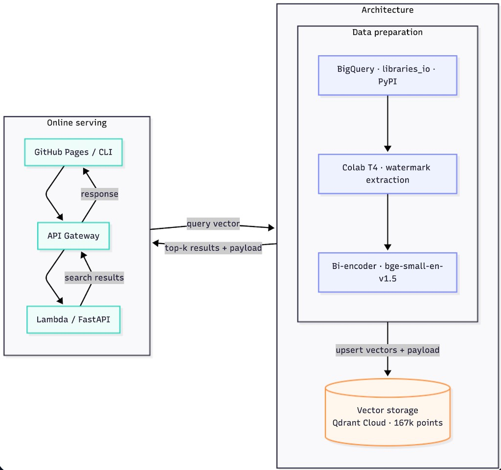
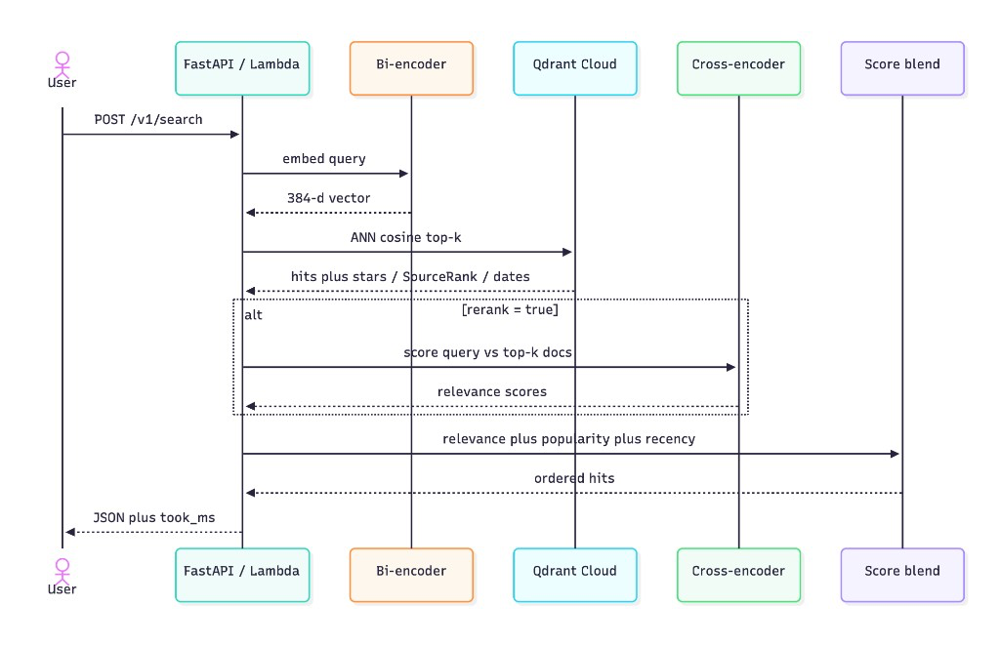

# SARR — Semantic Artifacts Retrieval and Ranking

SARR is a search system for software packages that ranks results by **meaning**,
not just keyword overlap. It indexes **166,819 PyPI packages** and answers
natural-language queries such as *“async HTTP client with retries”* or
*“machine learning”* — including packages whose names do not contain those words.

Offline indexing runs on GPU (Google Colab) with **PyTorch**. Online search
embeds the query, retrieves neighbors, optionally reranks, and blends
popularity and recency. An optional **LLM** path (Vertex Gemini) writes a
grounded top-3 from the retrieved packages only. Vectors live in **Qdrant
Cloud**. The API is **FastAPI** on **AWS Lambda**, where both the bi-encoder
and the cross-encoder run as **ONNX** (no PyTorch import on the request path).
The demo UI is a static Vite app on **GitHub Pages**. An optional **MCP**
stdio server lets coding agents call the same API as tools (`search_packages`,
`recommend_packages`, `health`) without loading ONNX or Gemini locally.
A **GraphQL** endpoint serves the same search with client-selected fields.
A scheduled **package health collector** (Lambda, provisioned with
**Terraform**) refreshes GitHub and PyPI signals into Qdrant for the
most-starred packages, whose metadata was frozen at 2018.

- **Live demo:** [kanchana123.github.io/sarr-recommendation-api](https://kanchana123.github.io/sarr-recommendation-api/)
- **API:** `https://isz2aki1n2.execute-api.us-east-1.amazonaws.com` (`/v1/search`, `/v1/rag`, `/graphql`, `/healthz`)
- **Write-up:** [DEV Community](https://dev.to/kanchan_nannavare/sarr-semantic-search-for-pypi-packages-built-on-a-serverless-budget-o4n)

### By the numbers

Latency and data figures are measured on the live system; dates and methods
are in the sections below.

| Area | Result |
|---|---|
| Corpus | **166,819** PyPI packages, 384-d embeddings in Qdrant Cloud |
| REST search (warm, server) | **p50 18 ms · p95 65 ms**; with cross-encoder rerank **p50 172 ms** |
| GraphQL search (warm, server) | **p50 15 ms · p95 16 ms** over 30 queries; client p50 149 ms |
| Grounded RAG | Ranked list **~350–520 ms**, Gemini top-3 **~0.65–1.2 s**, every citation checked against the retrieved set |
| Health collector, first scheduled run | **718** packages refreshed in one 15-minute Lambda run, **0** failures; **142** renamed repos corrected, **17** deleted repos and **111** archived repos flagged |
| Data freshness (refreshed packages) | `last_commit` filled for **701 / 718** (the old data had none; the other 17 repos are deleted); 30-day downloads for **621**; **333** show releases after 2018, the old dump's cutoff |
| Infrastructure as code | **24** Terraform resources, least-privilege IAM, secrets kept out of state, ~**$0/month** within free tier |
| Quality | **127** unit tests; CI runs pytest, Ruff and `terraform fmt` / `validate` |

---

## Why it exists

[PyPI.org](https://pypi.org) search is effective when you already know a package
name. It is less helpful when you only know the *problem*. SARR treats each
package as a short semantic document (name, description, keywords, stack hints)
and retrieves neighbors in embedding space, then reorders with maintenance and
adoption signals so popular, fresher projects tend to surface when relevance is
close.

---

## Architecture

Offline indexing (GPU, infrequent) is separate from online search (CPU, per request). Both paths share the same bi-encoder checkpoint (`BAAI/bge-small-en-v1.5`) and search-document format. ETL uses PyTorch; Lambda serves the same weights as ONNX.



Request path inside the API (`took_ms` is server-side time):



| Path | Role |
|---|---|
| **ETL** | Watermarked BigQuery extract → document build → PyTorch bi-encoder batch embed → idempotent Qdrant upsert |
| **Online search** | ONNX query embed → top‑k vector search → optional ONNX cross-encoder → α·relevance + β·popularity + δ·recency |
| **Online RAG** | Same retrieval (50 → top 8) → SSE `ranked_list` → Vertex Gemini top-3 with citation checks |
| **MCP (agents)** | Local stdio server → HTTP to the API; RAG SSE collapsed to one JSON tool result |
| **GraphQL** | Strawberry on the same FastAPI app; same search path as REST, client picks fields; depth and alias limits |
| **Health collector** | Nightly Lambda (EventBridge) → GitHub REST + PyPI + pypistats → Qdrant `set_payload` (no re-embedding); SQLite frontier in S3; Terraform-managed |
| **Shared** | Same embedding model and search-document format for index and query (no train/serve skew) |

Designed so indexing (heavy, infrequent, GPU) stays separate from serving
(lightweight per request). The Lambda container path and SAM template are in
`docker/` and `infra/` for a serverless deploy without changing the search core.

---

## Retrieval & ranking

- **Bi-encoder:** `BAAI/bge-small-en-v1.5` (384‑d). Colab ETL embeds the corpus with PyTorch; Lambda embeds queries with a baked ONNX graph.  
- **ANN:** cosine similarity over the full collection in Qdrant  
- **Rerank (optional):** `cross-encoder/ms-marco-MiniLM-L-6-v2` on a short top‑k list. Hosted Lambda runs this as ONNX as well (`rerank: true` in `POST /v1/search`). The demo **Rerank** checkbox controls this only.  
- **LLM / RAG (optional):** `POST /v1/rag` when the demo **LLM** checkbox is on. Gemini writes a citation-checked top-3 from the retrieved set. Generation does not run unless that box is checked.  
- **Blend:** semantic score mixed with popularity (stars, 30-day downloads or dependents, SourceRank) and recency (last commit, else latest release)  

Numeric popularity is kept in the **payload**, not stuffed into the embedding
text, so similarity stays about *what the package does*.

---

## RAG (grounded recommendations)

`POST /v1/rag` is opt-in. The demo **LLM** checkbox is the only UI control that
calls it. **Rerank** only toggles the cross-encoder (`rerank: true|false` on
search or RAG).

Pipeline:

1. Retrieve 50 neighbors (same embedder and Qdrant collection as `/v1/search`).
2. Optionally rerank those 50 with MiniLM; keep 8 packages for the prompt.
3. Stream `ranked_list` first so the UI is complete without Gemini.
4. Prompt Gemini with **name + description only** (no stars or URLs).
5. Parse JSON (`package`, `reason`, `cited_snippet`). Drop any package name
   that is not in the retrieved eight. Stream `llm_done` or `llm_error`.

Local defaults: `VERTEX_GEMINI_MODEL=gemini-2.5-flash-lite` with fallback
`gemini-2.5-flash`. Set `GCP_PROJECT_ID`. Locally, use `gcloud auth
application-default login`. On Lambda, put a Vertex service account JSON in
Secrets Manager (`sarr-search/gcp-vertex`); laptop ADC is not available there.
Vertex billing must be enabled. RAG works on the hosted Lambda, but API
Gateway HTTP APIs buffer SSE, so the ranked list and the top-3 arrive
together there; run locally (`make run-api`) to see incremental streaming.

```bash
curl -N http://localhost:8080/v1/rag \
  -H 'Content-Type: application/json' \
  -d '{"query":"async HTTP client","rerank":true}'
```

A local measured UI run (warm, rerank on) reported fast path **472 ms** and
Gemini top-3 **1.05 s** (`llm_ms`). On the hosted demo (warm, rerank + LLM):
ranked list **~350–520 ms** server `took_ms`, Gemini **~650 ms–1.2 s**
(`llm_ms`). API Gateway may buffer SSE, so the UI can receive both events
together.

---

## Package health collector

The ranking signals in the ETL (`stars`, `last_commit`, `latest_release`) come
from a static Libraries.io snapshot: `last_commit` and `downloads_30d` were
empty for every package and star counts were years old. `sarr-collect`
(`src/sarr/collect/`) refreshes them from the GitHub REST API, the PyPI JSON
API and pypistats, and adds health signals. It writes with Qdrant partial
payload updates (`set_payload`), so nothing is re-embedded.

| Piece | What it does |
|---|---|
| `http.py` | Shared polite client: descriptive User-Agent, per-host request spacing, sleeps until `X-RateLimit-Reset` when quota runs low, honors `Retry-After` on 429/403, exponential backoff with jitter on 5xx and network errors, ETag conditional requests (`If-None-Match`; GitHub 304s don't cost quota) |
| `github_client.py` | Repo stars, forks, open issues, push date, archived flag, last 5 commits. 404/451 → `gone`; 301 renames are followed and `repo_url` is updated |
| `pypi_client.py` | Latest release, median release cadence (yanked files ignored), `requires_python`; 30-day downloads from pypistats |
| `frontier.py` | SQLite frontier. Priority = `staleness_days × log1p(stars + sourcerank)`, so stale and popular packages go first. Three consecutive failures dead-letter a package |
| `health.py` | `health_score` (0..1): push recency 35%, release recency + cadence 25%, open issues per star 15%, commits in the last 90 days 25%. Archived repos are capped at 0.2 |
| `refresh.py` | Fetch → build fields → hash → write. An unchanged hash only updates `health_checked_at` |

New payload fields: `health_score`, `health_status` (`ok` / `gone` / `error`),
`health_checked_at`, `open_issues_count`, `release_cadence_days`,
`commits_90d`, `archived`. They are selectable on the GraphQL `Package` type
(locally now; on the hosted API after its next deploy). Hosted REST search
already ranks with the refreshed `stars`, `last_commit` and `latest_release`
and returns every health field in each hit's `metadata`, which the demo UI
shows as badges (health score, last commit, commits in 90 days, archived,
repo gone).

```bash
export GITHUB_TOKEN=…                        # 5,000 requests/hour instead of 60
sarr-collect backfill --top-n 10000          # seed from Qdrant: GitHub-linked, most-starred first
sarr-collect refresh --limit 1000 --max-hours 1
sarr-collect status                          # pending, checked, failing, dead-lettered, last run
```

**Refresh policy.** A package is due when it has never been checked or its
last check is older than `COLLECTOR_STALE_DAYS` (default 7). Runs are budgeted
by `--limit` and `--max-hours`, and the client stops instead of sleeping past
the deadline, so it suits a nightly job. The dedup hash compares
`health_score` in 0.05 steps: time decay alone doesn't trigger a rewrite, and
a stored score lags its true value by at most one step.

**Measured** on a 40-package copy of the collection: the first refresh used 30
GitHub requests (packages sharing a repo hit the ETag cache), an immediate
rerun selected nothing, and a forced recheck wrote 0 payloads, 40 unchanged,
using 1 GitHub request. A 215-package run found 38 renamed repos (for example
`andymccurdy/redis-py` → `redis/redis-py`).

**First scheduled production run** (Lambda, 9 Oct 2026, the 718 most-starred
GitHub-linked packages):

| Before (Libraries.io dump) | After one run |
|---|---|
| `last_commit` empty for all 166,819 packages | Filled for **701** of 718 (the other 17 repos are gone); **441** committed in 2026 |
| `downloads_30d` empty for all packages | Filled for **621**, totalling **13.7 billion** downloads per 30 days |
| Newest `latest_release` anywhere: Dec 2018 | **333** of 718 have later releases, **173** of them in 2026 |
| No maintenance signal | **111** archived and **17** deleted repos flagged; **142** renamed repos corrected; median `health_score` 0.66 |

**Ranking.** Phase 1 needs no code change: fresher `stars`, `last_commit`,
`latest_release` and `downloads_30d` feed the existing popularity and recency
terms. Phase 2 adds `RANK_EPSILON × health_score` (other terms scaled by
`1 − ε`; unscored packages count as 0.5). It is **off by default**
(`RANK_EPSILON=0`) until it is validated on an eval set, which this repo does
not have yet.

### Scheduled collector on AWS (Terraform)

`infra/terraform/collector/` runs the collector as a scheduled Lambda
(`sarr.collect.lambda_handler`), separate from the search API stack.

| Resource | Purpose |
|---|---|
| Lambda (Python 3.12, 512 MB, 15 min) | Zip from `scripts/build_collector_lambda.sh`: only `sarr.common` + `sarr.collect` and four dependencies (no FastAPI or torch). The build is reproducible, so an unchanged zip doesn't redeploy |
| EventBridge rules | Nightly `refresh` (07:00 UTC) and weekly `backfill` (Sunday 06:00 UTC) to add newly popular packages. Async invoke, no retries |
| S3 bucket | Holds the SQLite frontier between runs (Lambda `/tmp` is wiped). Versioned, encrypted, public access blocked, TLS only. Old versions expire after 30 days |
| S3 run lock | `collector.sqlite.lock` written with `If-None-Match: *`, so overlapping runs can't clobber the frontier. A lock older than 30 minutes is taken over |
| SSM SecureString | `GITHUB_TOKEN` and `QDRANT_API_KEY`. Terraform creates placeholders and ignores their values, so secrets never enter Terraform state. The Lambda refuses to run on a placeholder |
| IAM role | Its own log group, `collector/*` in its bucket, its two parameters, and `kms:Decrypt` via SSM only |
| CloudWatch | Per-run counts as Embedded Metric Format (`SARR/Collector`: processed, written, unchanged, gone, failed, …). Alarms on Lambda errors, a missed daily run and ≥ 50 failed packages, sent to an SNS topic (optional email) |

Each run takes the lock, downloads the frontier, backfills if there is none
yet, refreshes until 90 s before the timeout, uploads the frontier and
releases the lock (the upload happens even if the refresh fails).
The first run refreshed 718 packages in 13 min 14 s (about 1.1 s per package
including pypistats, which allows 60 requests per minute), so a
10,000-package frontier turns over in about two weeks.

```bash
make collector-build                       # build/collector_lambda.zip
cd infra/terraform/collector
cp terraform.tfvars.example terraform.tfvars   # set qdrant_url (and alarm_email)
terraform init && terraform plan && terraform apply

# then set the real secrets once (names are in the outputs)
aws ssm put-parameter --overwrite --type SecureString \
  --name /sarr-collector/github-token --value "$GITHUB_TOKEN"
aws ssm put-parameter --overwrite --type SecureString \
  --name /sarr-collector/qdrant-api-key --value "$QDRANT_API_KEY"

terraform output -raw manual_run_command | sh   # optional: run now
```

---

## Performance

Latency below is **server `took_ms`** (embed + Qdrant + optional rerank + blend), which measures the search itself. **Client RTT** adds the network round trip to `us-east-1` and is what a browser feels. Cold starts are listed separately, not mixed into the percentiles.

| Condition | Server `took_ms` | Notes |
|---|---|---|
| Cold, `rerank=false` | **~5 s** | First request after idle; loads ONNX bi-encoder |
| Cold, `rerank=true` | **~16 s** | Also loads ONNX MiniLM cross-encoder |
| Warm, `rerank=false` | **p50 18 ms · p95 65 ms · p99 67 ms** | 50 sequential mixed queries |
| Warm, `rerank=true` | **p50 172 ms · p95 257 ms** | ~154 ms extra for the cross-encoder; client p50 ~271 ms |
| Warm stages | embed **~7 ms**, Qdrant **~10 ms** (p50) | Same embed/Qdrant split with or without rerank |
| GraphQL, warm | **p50 15 ms · p95 16 ms** | 30 sequential queries, `limit: 10`, no rerank, 9 Oct 2026; client p50 149 ms |
| Hosted RAG (warm, rerank + LLM) | ranked **~350–520 ms** · Gemini **~650 ms–1.2 s** | Server `took_ms` + `llm_ms`; SSE may not stream on API Gateway |

The index load embedded and upserted **167,619** rows on a Colab T4 (PyTorch), which collapsed into **166,819** unique packages. Collector throughput is in [Scheduled collector on AWS](#scheduled-collector-on-aws-terraform).

Warm REST percentiles: `scripts/measure_latency.py`, **20 Aug 2026**, 1 warmup + 50 requests against the live API (`isz2aki1n2…`), all succeeded. Client RTT from the laptop that ran the script: p50 **117 ms** (no rerank), **271 ms** (rerank); p95 **193 ms** / **421 ms**. A cold `rerank=true` request can hit API Gateway’s **30 s** limit (503) while ONNX sessions load — warmup once before measuring. API Gateway HTTP APIs still cap the client wait at **30 s**, which is why Lambda uses ONNX instead of importing PyTorch.

Each response also includes `took_ms` and `timing_ms` (`embed_ms`, `qdrant_ms`, `rerank_ms`).

### How to measure latency

Warmup **once**, then run sequential searches. Do not mix the first cold load into p50/p95.

```bash
# Hosted API — no rerank
python3 scripts/measure_latency.py \
  --url https://isz2aki1n2.execute-api.us-east-1.amazonaws.com \
  --n 50

# Hosted API — with rerank (warm up once; cold start can 503 at 30 s)
curl -s "$SARR_API_URL/v1/search" -H 'Content-Type: application/json' \
  -d '{"query":"warmup","limit":5,"rerank":true}' >/dev/null
python3 scripts/measure_latency.py --url "$SARR_API_URL" --n 50 --rerank --skip-warmup

# Local API (start it first)
export SARR_API_URL=http://localhost:8080
make latency
```

The script prints per-request client RTT and the server’s `took_ms` / `embed_ms` / `qdrant_ms`, then p50 / p95 / p99. One-off:

```bash
curl -sS -w "\nHTTP:%{http_code} TIME:%{time_total}\n" \
  "$SARR_API_URL/v1/search" \
  -H 'Content-Type: application/json' \
  -d '{"query":"async HTTP client","limit":10,"rerank":false}' | python3 -m json.tool
```

Look at `took_ms` and `timing_ms` in the JSON for server-side time; curl’s `TIME` is the full round trip.

---

## Tech stack

| Layer | Choice |
|---|---|
| Data | BigQuery public Libraries.io (`projects` ⨝ `repositories`), PyPI filter |
| ML | sentence-transformers / PyTorch (ETL); ONNX Runtime (Lambda embed + rerank); Vertex Gemini (optional RAG) |
| Store | Qdrant Cloud |
| API | FastAPI, Pydantic v2, Mangum (Lambda); SSE on `POST /v1/rag`; GraphQL (Strawberry) on `/graphql` |
| Packaging | `src/` layout, `pyproject.toml`, optional extras (`api` / `etl` / `dev`) |
| UI | Vite static multi-page demo |
| Agents | MCP stdio server (`sarr[mcp]`) — tools wrap `/v1/search`, `/v1/rag`, `/healthz` |
| Data refresh | `sarr-collect`: httpx with rate-limit, `Retry-After` and ETag handling; SQLite priority frontier; Qdrant partial payload updates |
| Quality | pytest unit suite (127 tests), Ruff, GitHub Actions CI incl. `terraform fmt` / `validate` |
| Deploy artifacts | Docker (local API + Lambda image), SAM template (search API), Terraform (collector: Lambda, EventBridge, S3, SSM, IAM, CloudWatch, SNS) |

---

## Repository layout

```text
sarr-recommendation-api/
├── src/sarr/
│   ├── common/     # schemas, search-document builder, settings
│   ├── api/        # FastAPI, embedder, reranker, RAG + Gemini, ranking, Qdrant client
│   ├── mcp/        # MCP stdio tools → HTTP API (search + RAG)
│   ├── collect/    # sarr-collect: GitHub/PyPI health refresh → Qdrant set_payload
│   └── etl/        # BigQuery extract → transform → embed → load
├── notebooks/      # Colab GPU ETL
├── frontend/       # Search · How it works · Contact
├── docker/         # API + Lambda images
├── infra/          # SAM template, deploy docs, terraform/collector (scheduled collector)
├── scripts/        # deploy_lambda.sh, build_collector_lambda.sh, measure_latency.py, …
└── tests/          # unit (CI) + opt-in integration
```

---

## Quick start (local API + Qdrant Cloud)

```bash
cp .env.example .env   # set QDRANT_URL, QDRANT_API_KEY, QDRANT_COLLECTION
python3 -m venv .venv && source .venv/bin/activate
make install
make run-api           # http://localhost:8080
```

### CLI

Install once, then search without typing a URL (defaults to
`http://localhost:8080`, or `$SARR_API_URL` if set).

```bash
# terminal 1 — start the API (once)
cp .env.example .env   # Qdrant Cloud credentials
pip install -e ".[api]"
make run-api

# terminal 2 — use the CLI
pip install -e .       # lightweight client is enough when using the API
sarr health
sarr search "async HTTP client"
sarr search "machine learning" -n 5 --rerank
sarr search "http library" --json
```

Optional: point at another host without flags on every command:

```bash
export SARR_API_URL=https://your-deployed-api.example.com
sarr search "dataframe library"
```

In-process mode (no server; loads models locally):

```bash
pip install -e ".[api]"
sarr search "http client" --local
```

### MCP (agents / Cursor)

Thin **stdio wrapper** around the HTTP API. The MCP process uses `httpx` only —
no ONNX, Qdrant, or Gemini loaded in the agent's MCP child process. **Does not
run on Lambda**; run it locally (or on any machine with Cursor) and point
`SARR_API_URL` at a running API.

```bash
python3 -m venv .venv && source .venv/bin/activate   # once
make install-mcp
make run-api   # terminal 1

# terminal 2 — blocks on stdio; wire Cursor to this process
export SARR_API_URL=http://localhost:8080
make run-mcp
```

| Tool | API | When to use |
|---|---|---|
| `search_packages` | `POST /v1/search` | Fast semantic lookup (`query`, `limit`, `rerank`) |
| `recommend_packages` | `POST /v1/rag` | Grounded top-3 with citations; waits for SSE, returns one JSON blob |
| `health` | `GET /healthz` | Check the API before searching |

`recommend_packages` output shape (agents never see SSE tokens):

```json
{
  "query": "async HTTP client",
  "ranked": [{ "name": "httpx", "summary": "…", "score": 0.9, "stars": 12000 }],
  "recommendations": [{ "package": "httpx", "reason": "…", "cited_snippet": "…" }],
  "dropped": [],
  "fast_path_ms": 420,
  "llm_ms": 1050,
  "error": null
}
```

If Gemini fails, `error` is set and `ranked` is still populated — same contract
as the demo UI. Citation guardrails stay on the API; MCP does not invent packages.

**Cursor:** copy [`.cursor/mcp.json.example`](.cursor/mcp.json.example) → `.cursor/mcp.json`, reload MCP. Use `http://localhost:8080` for development, or the hosted `ApiUrl` for search and RAG (API Gateway may deliver RAG SSE in one block).

```bash
mcp dev src/sarr/mcp/server.py   # optional Inspector (pip install "mcp[cli]")
```

```bash
curl -s http://localhost:8080/v1/search \
  -H 'Content-Type: application/json' \
  -d '{"query":"http client library","limit":5,"rerank":false}'
```

```bash
cd frontend && cp .env.example .env && npm install && npm run dev
```

### Docker (recommended for reviewers)

Requires [Docker](https://docs.docker.com/get-docker/) + Compose. The API image
bundles FastAPI and the embedding stack; point it at **Qdrant Cloud** (the
indexed corpus) via `.env`.

```bash
git clone https://github.com/kanchana123/sarr-recommendation-api.git
cd sarr-recommendation-api
cp .env.example .env
# Edit .env — set at least:
#   QDRANT_URL=https://….aws.cloud.qdrant.io
#   QDRANT_API_KEY=…
#   QDRANT_COLLECTION=sarr

docker compose up --build -d
# or: make docker-up

curl -s http://localhost:8080/healthz
curl -s http://localhost:8080/v1/search \
  -H 'Content-Type: application/json' \
  -d '{"query":"machine learning","limit":5,"rerank":false}'

docker compose logs -f api    # first search downloads model weights (~once; cached in a volume)
docker compose down
```

Build the image alone:

```bash
docker build -f docker/Dockerfile.api -t sarr-api:latest .
docker run --rm -p 8080:8080 --env-file .env sarr-api:latest
```

Optional empty local Qdrant (no corpus until you run ETL):

```bash
QDRANT_URL=http://qdrant:6333 docker compose --profile local-qdrant up --build
```

### Deploy to AWS Lambda

Full pipeline: **[infra/README.md](infra/README.md)**.

```bash
cp infra/deploy.env.example infra/deploy.env   # Qdrant URL + key
make gcp-setup-vertex                          # Vertex SA → Secrets Manager (before deploy)
make deploy-lambda-guided                        # first time
make deploy-lambda                               # later redeploys
# or: make deploy-lambda-full                    # GCP auth + deploy in one step
```

Scripts live in `scripts/setup_gcp_vertex_auth.sh` and `scripts/deploy_lambda.sh`.
SAM template: `infra/template.yaml`. Example config: `samconfig.toml.example`.

Stack output **ApiUrl** is the public endpoint (`/v1/search`, `/v1/rag`, `/graphql`, `/healthz`).
Set `GcpProjectId=sarr-505305` (default) plus the GCP secret from `make gcp-setup-vertex`
so the hosted UI **LLM** checkbox can call Vertex Gemini.

GitHub Pages: set repository variable `VITE_API_BASE_URL` to that `ApiUrl`, enable Pages
with **Source: GitHub Actions**, then run **Deploy frontend** (`.github/workflows/pages.yml`).

### ETL (Colab)

Open `notebooks/etl_colab.ipynb`, use a GPU runtime, set billing `GCP_PROJECT_ID`
and Qdrant credentials, run the diagnostic count, then the full pipeline.
`LAST_UPDATE_DATE=1970-01-01` for the initial load; afterward the watermark file
drives incremental runs. The watermark is saved after each successful batch, so
a Colab disconnect resumes without duplicating points (Qdrant upserts by stable
package id).

### Tests

```bash
make install-dev
make test
```

---

## API

| Method | Path | Notes |
|---|---|---|
| `GET` | `/healthz` | Liveness |
| `POST` | `/v1/search` | `{ "query", "limit", "rerank" }` → ranked hits + `took_ms` |
| `POST` | `/v1/rag` | `{ "query", "rerank" }` → SSE `ranked_list`, then `llm_delta` / `llm_done` (Vertex Gemini, citation-checked top-3) |
| `POST` | `/graphql` | `search(query, limit, rerank, filters)` and `health` — same search path as `/v1/search`, clients pick fields |

OpenAPI docs: `http://localhost:8080/docs`. GraphiQL: open `http://localhost:8080/graphql` in a browser.

```bash
curl -s http://localhost:8080/graphql -H 'Content-Type: application/json' -d '{
  "query": "{ search(query: \"async HTTP client\", limit: 3, rerank: true) { tookMs packages { name stars license } } }"
}'
```

GraphQL requests are capped at depth 6 and 5 aliases, so one request can't fan out into many searches.

The demo UI has two independent checkboxes. **Rerank** sends `rerank` on `/v1/search` (or on `/v1/rag` when LLM is also on). **LLM** is the only control that calls `/v1/rag` and Gemini.

**MCP** exposes the same endpoints as agent tools: `search_packages` → `/v1/search`, `recommend_packages` → `/v1/rag` (SSE consumed server-side), `health` → `/healthz`. See [MCP (agents / Cursor)](#mcp-agents--cursor) above.

`POST /v1/rag` streams Server-Sent Events. The ranked list is emitted first; generation uses Vertex Gemini (`GCP_PROJECT_ID` plus ADC locally, or a Secrets Manager service account on Lambda). API Gateway HTTP APIs buffer the stream, so on the hosted API both events arrive together; the MCP tool waits for the full SSE response either way. An eval harness for RAG (precision@k, citation accuracy, faithfulness, cost) is not built yet.

---

## Roadmap

- Redeploy the search API so hosted GraphQL exposes the health fields (in the code, not yet on the hosted endpoint)
- Eval set (nDCG) to validate `RANK_EPSILON × health_score` before turning it on, and to tune ranking weights
- Don't credit packages that link someone else's repository (e.g. `flask-next` → `pallets/flask`) with that repository's stars
- Hybrid sparse + dense retrieval for exact name matches

---

## License

See [LICENSE](LICENSE).
